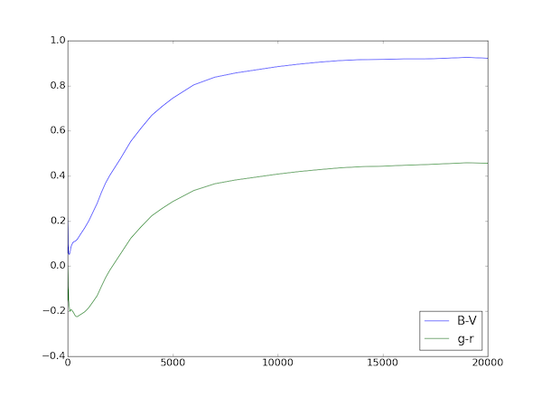
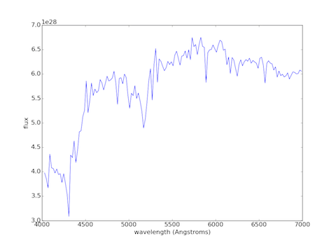
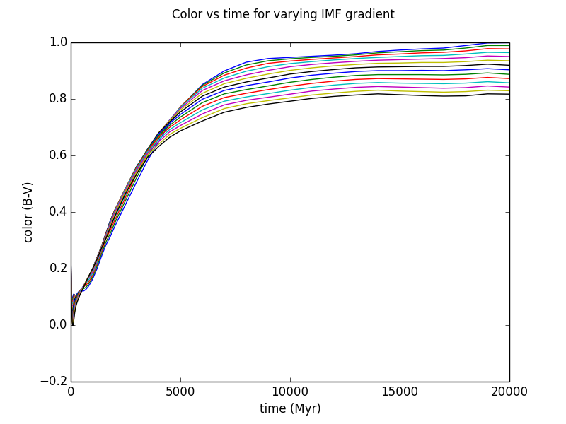

PyPegase 0.1
============

Introduction
------------

PyPegase provides a convenient way to generate galaxy models using the `PEGASE <http://www2.iap.fr/users/fioc/PEGASE.html>`_ version 2 code. It provides a wrapper class that encapsulates
the parameters to, and results from the PEGASE binaries. This makes it much simpler to explore the paramater space and examine the outputs from
the resulting models.
       
PyPegase assumes you have a clean installation of the PEGASE2 code, and have compiled the Fortran sources to produce executable binaries called ``SSPs``,
``scenarios``, ``spectra``, ``calib`` and ``colors``.

For more on PEGASE see the docs: http://arxiv.org/abs/astro-ph/9912179

Installation and configuration
------------------------------

If you use pip, install with::

  pip install pypegase

alternatively, get from github::

  git clone https://github.com/coljac/pypegase.git

and add the directory to your ``PYTHONPATH`` environment variable.

You will also need to point PyPegase to your PEGASE2 directory, the location of the binaries (such as ``SSPs``, etc). The best way to do this is with a ``PEGASE_HOME`` environment variable, but can be done at runtime by setting ``PEGASE.pegase_dir = "<path to PEGASE>"``.

You can also create a ``.pypegase`` file to override the module's defaults - see defaults_ below.

Usage
-----

Usage of PyPegase is centred on the PEGASE class which encapsulates a run of the PEGASE code. Other classes such
as ``IMF``, ``SSP``, ``SFR`` and ``Scenario`` wrap the inputs to the PEGASE code, though use of
these is in most cases optional.

The basic workflow is as follows:

- Create an ``IMF`` object for your model (optional)
- Create an ``SSP`` object with the IMF (optional)
- Create one or more ``Scenario`` objects (optional)
- Create ``PEGASE`` instance, passing in the above
- Invoke ``.generate()`` on the ``PEGASE`` object, which generates the data files
- Access the results via the ``colors()`` and ``spectra()`` methods
- Save the resulting object with ``save_to_file()`` so it can be later loaded with ``PEGASE.from_file()`` and save on generation time.

All of this can be done in one line, see the examples below.

Note that all the outputs created by PEGASE end up in the PEGASE home directory.

.. _defaults:

Defaults
--------

The default values are all as per the PEGASE documentation and code, with the following exceptions:

- The default IMF is Salpeter 1955
- The default SFR is exponentially decreasing instead of instantaneous burst, with the default values for p1 and p2 as per the code (1000 and 1 respectively).

For convenience, defaults can be overridden by creating a file ``.pypegase`` in your home directory. It
should have the format::
  
  variable = value
  variable2 = value2
  ...

To see the built-in defaults, execute ``PEGASE.list_defaults()``. You can use this string as a template. To get started, try::

  python -c "import pypegase as pp; pp.PEGASE.list_defaults()" > ~/.pypegase

This will create an file for you that you can edit should you wish to override some of the defaults. (Note: If pypegase.py is not in your system's library dir, you will need it in the current directory or you can add the location of pypegase.py to to ``PYTHONPATH`` environment variable.)

Spectra and colors
------------------

Generated spectra and colors data can be obtained with the ``spectra()`` and ``colors()`` methods respectively. In each case the result will be an Astropy `table.Table <http://docs.astropy.org/en/stable/table/index.html>`_  with a row for each timestep. 

Both of these methods can take a list of columns as the ``cols`` parameter. For spectra especially the resulting table is very large and it may make sense to filter the results in this way. The available column names are the wavelengths and spectral lines as they appear in the xxx_spectra.dat file as well as the following::

        time m_gal m_star m_wd m_nsbh m_substellar m_gas z_ism z_stars_mass
        z_stars_bl l_bol od_v l_dust_l_bol sfr phot_lyman rate_snii rate_snia 
	age_star_mass age_star_lbol
 
Note that column names must match PEGASE's file output exactly - so for instance  "100200." will work, but
"100200" will not.
	
The available column names can be viewed with ``peg_instance.spectra().colnames()`` (and the same for colors).

The table returned by these methods can be further filtered with the ``time_lower`` and ``time_upper`` keywords; for example, to return only rows with a time between 100 and 13000 Myr, call ``colors(time_lower=100, time_upper=13e3)``.

These methods return a table which can be accessed as ``mytable['colname']`` (returns entire column) or ``mytable['colname'][n]`` (returns column _colname_ at row _n_).

Examples
--------
Generate a set of data using the defaults, in files prefixed with ``mydata_``::

    from pypegase import *
    import matplotlib.pyplot as plt

    PEGASE.pegase_dir = '/home/me/PEGASE.2/' # unless PEGASE_HOME is set

    peg = PEGASE('mydata') # default IMF, Scenario, etc
    peg.generate() # some minutes may be required, console will show progress
    colors = peg.colors()
    colors['B-V'][-1] # B-V color at last timestep (20 Gyr) = .922
    plt.plot(colors['time'], colors['B-V']) # plot times versus B-V color
    plt.plot(colors['time'], colors['B-V'], "b-", label="B-V") # plot times versus B-V color
    plt.plot(colors['time'], colors['g-r'], "g-", label="g-r")
    plt.legend(loc = 'lower right', numpoints=1)

    peg.save_to_file(peg.name + '.peg')

    peg2 = PEGASE.from_file(peg.name + '.peg')
    peg2.colors() # Same as above

Plotting a continuum spectrum at t=13000 Myr::

  peg = ... # one I made earlier with defaults
  spectra = peg.spectra(time_lower=13000, time_upper=13000)
  lambdas = []
  vals = []
  filters = (4010, 7010) # lower, upper wavelengths (roughly V)
  for col in spectra.colnames:
      try:
          l = float(col)
          if l > filters[0] and l < filters[1]:
              lambdas.append(l)
              vals.append(spectra[col][0])
      except ValueError:
          pass # Column is not a number (i.e. wavelength)
  plot(lambdas[:149], vals[:149], "b-") # Removed the lines for this example
  xlabel("wavelength (Angstroms)")
  ylabel("flux")

	
Specifying parameters explicitly (these are all the default values and any can be omitted)::

    peg = PEGASE("custom", ssps=SSP(
        IMF(IMF.IMF_Salpeter), ejecta=SNII_ejecta.MODEL_B, winds=True
    ), scenario=Scenario(
        binaries_fraction=0.04, metallicity_ism_0=0, infall=False, sfr=SFR(SFR.EXPONENTIAL_DECREASE, p1=1e3, p2=1),
        metallicity_evolution=True, substellar_fraction=0, winds=False, neb_emission=True,
        extinction=Extinction.NO_EXTINCTION
    ))
    peg.generate()
    spec = peg.spectra(cols=['time', 'l_bol', '7135.00'])
    spec['l_bol'][20] # == 2.499E34

Experimenting with IMFs::

    # Built-in
    imf = IMF(IMF.IMF_Scalo86)
    imf = IMF(IMF.IMF_MillerScalo) # and so on for built-in IMFs

    # Custom
    imf = IMF(IMF.CUSTOM, lower_mass=0.1, upper_mass=120, gamma=-1.35) # A custom IMF equivalent to Salpeter with
                                                                       # default cutoffs
    imf = IMF(IMF.CUSTOM, lower_mass=0.1, upper_mass=120, powers=[
        (0.1, -0.4),
        (1., -1.5),
        (10., -2.3)
    ]) # A custom IMF equivalent to Miller-Scalo (see IMF_MillerScalo.dat)

    peg = PEGASE("custom_imf", ssps=SSP(imf))

Generating a series of models with varying parameters::

    pegase = PEGASE('test')
    for gamma in np.arange(-1.7, -1.0, 0.05):
        # Reuse the same instance each iteration
        pegase.name = "imftest_" + str(gamma)
        pegase.ssps.imf = IMF(IMF.CUSTOM, gamma=gamma)
        pegase.generate()
        pegase.save_to_file(pegase.name + ".peg")

Plotting the results::

    pegs = PEGASE.from_dir(".")
    # Now we have a list of PEGASE instances

    for i, peg in enumerate(pegs):
        colors = peg.colors(cols=['B-V']) # Note 'time' included by default
        plt.plot(colors['time'], colors['B-V'])

    plt.suptitle(r'Color vs time for varying IMF gradient')
    plt.xlabel('time (Myr)')
    plt.ylabel('color (B-V)')
    plt.show()

Further work
------------

Future versions will include:

- Passing a redshift value into spectra and colors
- Custom filters
- Calculating colors directly from spectra information
- Better ability to handle customised installations of PEGASE, in particular an altered IMF list/timesteps
- Ability to instantiate from a dictionary, JSON and other formats
- Ability to access color and spectra data by time as well as row number
- More intuitive use of multiple scenarios
- Ability to specify your own defaults
- Simplified process for wrapping an existing run (will examine the file system and reverse-engineer the parameters)
- Human-readable pickled (saved) files
- Unit tests for a greater variety of scenarios
- A more robust ``copy()`` implementation
- Console GUI

Acknowledgement
---------------
PyPegase was written with the support of the Centre for Astrophysics and Supercomputing at
Swinburne University of Technology.
